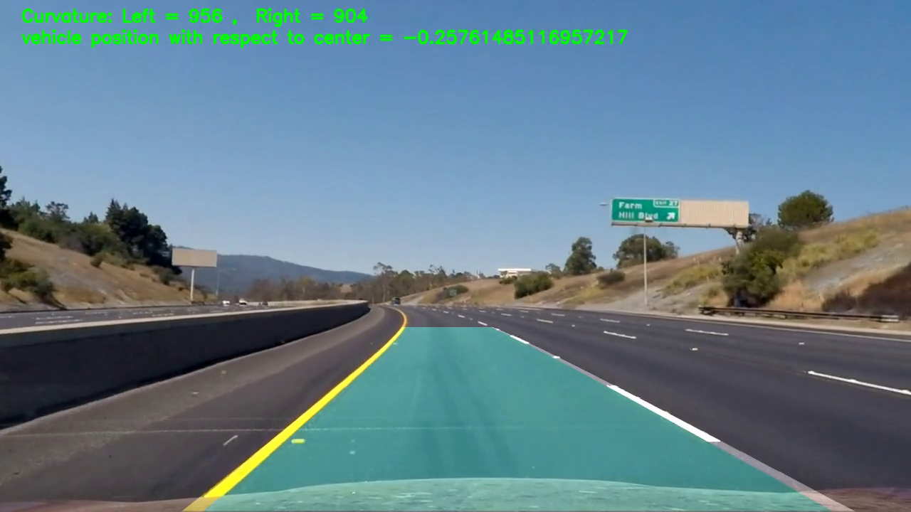

# **Advanced Lane Finding Project** 

The steps of this project are the following: 

* Compute the camera calibration matrix and distortion coefficients given a set of chessboard images.
* Apply a distortion correction to raw images.
* Use color transforms, gradients, etc., to create a thresholded binary image.
* Apply a perspective transform to rectify binary image ("birds-eye view").
* Detect lane pixels and fit to find the lane boundary.
* Determine the curvature of the lane and vehicle position with respect to center.
* Warp the detected lane boundaries back onto the original image.
* Output visual display of the lane boundaries and numerical estimation of lane curvature and vehicle position.

[//]: # (Image References)

[image1]: ./output_images/calibration.jpg "Chessboard Calibration"
[image2]: ./output_images/Undistorted_Image.jpg "Undistorted"
[image3]: ./output_images/color_binary_Image.jpg "thresholded binary Image"
[image4]: ./output_images/birds_eye_view_Image.jpg "Warp Example"
[image5]: ./output_images/Detect_lane_pixels_Image.jpg "Detect lane pixels"
[image6]: ./output_images/Final_Image1.jpg "Output"
[video1]: ./project_video_output.mp4 "Video"

### Camera Calibration

I start by preparing "object points", which will be the (x, y, z) coordinates of the chessboard corners in the world. Here I am assuming the chessboard is fixed on the (x, y) plane at z=0, such that the object points are the same for each calibration image.  Thus, `objp` is just a replicated array of coordinates, and `objpoints` will be appended with a copy of it every time I successfully detect all chessboard corners in a test image.  `imgpoints` will be appended with the (x, y) pixel position of each of the corners in the image plane with each successful chessboard detection.  

I then used the output `objpoints` and `imgpoints` to compute the camera calibration and distortion coefficients using the `cv2.calibrateCamera()` function.  I applied this distortion correction to the test image using the `cv2.undistort()` function and obtained this result: 

![alt text][image1]

### Pipeline (single images)

####  1. Undistoring a Image

I apply the distortion correction to one of the test images like this one:
![alt text][image2]

#### 2. Image Thresholding

I used a combination of color and gradient thresholds to generate a binary image (thresholding steps in the sixth and seventh code cells from the top).  Here's an example of my output for this step.  

![alt text][image3]

#### 3. Perspective Transformation

The code for my perspective transform is titled "Perspective Transform" in the Jupyter notebook, in the eighth and ninth code cells from the top.  The function takes as inputs an image (`img`), as well as source (`src`) and destination (`dst`) points.  I chose the source and destination points in the following manner:

| Source        | Destination   | 
|:-------------:|:-------------:| 
| 200,720       | 318,720       | 
| 579, 460      | 318, 0        |  
| 706, 460      | 961, 0        |
| 1128,720      | 961,720       |

Here's an example of my output for this step: 

![alt text][image4]

#### 4. Lane Detections

Functions "search_scratch" and "Detect_lane_pixels"  are used to identify lane lines and fit a second order polynomial to both right and left lane lines.

search_scratch : will search in each frame individually  

Detect_lane_pixels : will use Polynomial fit values from the previous frame 

first i will will search in each frame from scratch and then if the detected lane lines is not correct ( Radius of Curvature less than 500) then I will use Polynomial fit values from the previous frame dentify lane lines and if detected lane lines is still not correct then i will use the data and it rarely happend 

![alt text][image5]

#### 5. Radius of Curvature and the position of the vehicle with respect to center

I did this in cell number 12 

#### 6. Plotting back the Identified lanes on Image

Here is an example of my result on a test image:

![alt text][image6]

---

### Pipeline (video)

#### The final video of the pipeline implementation :

Here's a [link to my video result](./project_video_output.mp4)
And a [YouTube link](https://youtu.be/g_UR75UZRFI) 
---

### Discussion

My implementation needs improvement so it will be able to do well at the challenge_video.mp4 and harder_challenge_video.mp4 

